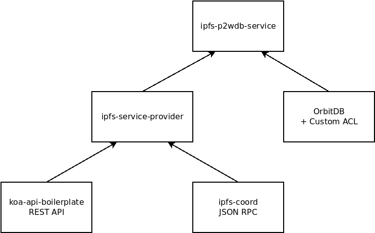

# Developer Documentation

This directory contains Markdown documents which describe the architecture of the pay-to-write database (P2WDB). Officially, the P2WDB is "a peer-to-peer database based on [OrbitDB](https://github.com/orbitdb/orbit-db) that requires proof-of-burn in order to add entries to the database". The documents in this directory serve to expand on that statement, and describe all the subcomponents that go into that idea.

## OrbitDB

[OrbitDB](https://github.com/orbitdb/orbit-db) is a peer-to-peer (p2p), append-only 'database' that runs on top of [IPFS](https://ipfs.io), using [pubsub channels](https://docs.libp2p.io/concepts/publish-subscribe/). This software is at the heart of the P2WDB concept. Stop here and understand OrbitDB before continuing, as not much will make sense without a strong understanding of what OrbitDB is and how it works.

The biggest change that P2WDB makes is to add a custom [Access Control Library](https://github.com/orbitdb/orbit-db-access-controllers) (ACL) to OrbitDB. This ACL requires that users submit a proof-of-burn in order to write data to the database. Anyone can read from the database.

## Proof-of-Burn

The 'big innovation' in this project is to combine OrbitDB with a proof-of-burn to control database writes. The proof-of-burn is simply a transaction ID (TXID) on a blockchain. Each independent copy of the P2WDB will evaluate this transaction and verify that the transaction involves burning a specific quantity of a specific token. If those criteria are met, then the user is allowed to write data to the database. Otherwise the write request is rejected. Each instance of the P2WDB independently validates these write entries, similar to blockchain.

Right now the Bitcoin Cash (BCH) blockchain is used for the proof-of-burn, but one goal of this project is to expand the proof-of-burn to other blockchain, including [Avalanche](https://www.avax.network/) and [eCash](https://e.cash). Implementing interfaces for different blockchains will allow the P2WDB to become a medium for cross-blockchain communication. For example, an event on one blockchain could trigger a smart contract or Script on another blockchain.

Currently, the proof of burn requires 0.01 [PSF tokens](https://psfoundation.cash) burned in order to write 10KB of text data to the database. These numbers will probably change in the future, but these are what is currently implemented.

## P2WDB API & RPC

There are two network interfaces for the P2WDB:

- REST API over HTTP
- JSON RPC over IPFS

Both interfaces are maintained in the [ipfs-service-provider](https://github.com/Permissionless-Software-Foundation/ipfs-service-provider) repository, and are not directly maintained in the ipfs-p2wdb-service repository. Instead, changes around the interfaces are either pushed or pulled from the upstream ipfs-service-provider repository.

The REST API is based on this [koa boilerplate](https://github.com/christroutner/koa-api-boilerplate). It allows the P2WDB to be interfaced with conventional Web 2.0 technology. It's expected that the P2WDB will be bundled with additional software, probably using Docker containers. The REST API provides a great way for orchestrated software to communicate, both via intranet or internet.

The JSON RPC is based on the [ipfs-coord](https://github.com/Permissionless-Software-Foundation/ipfs-coord#readme) library. This library uses IPFS pubsub channels to allow new IPFS nodes to quickly find one another and establish an end-to-end encrypted (e2ee) connection. They can then communicate by passing JSON RPC commands.

Reads and writes to the P2WDB can be accomplished over either REST API over HTTP or JSON RPC over IPFS. Which one is preferable depends on the use-case. Here is the software dependency tree for the software stack making up the P2WDB interfaces:

